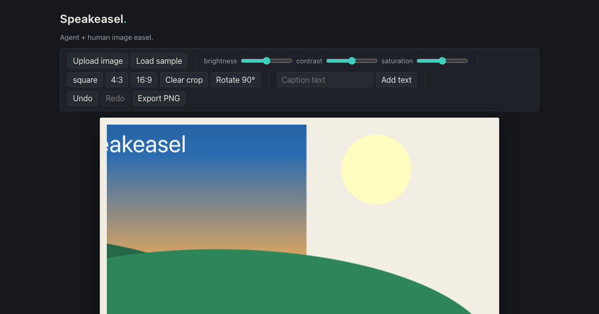

# Speakeasel



Speakeasel is an image easel a human and an AI agent edit **together** — and a bet that the most useful thing an agent can do on a canvas is *see it for someone who can't*. The human uploads a photo, drags captions, and rides the sliders; the agent adjusts, crops, rotates, and captions through WebMCP tools — and reads the whole canvas back as prose. `describe_canvas` is **a screen reader that can write back**: the same narration that makes the scene legible to the agent makes it legible to a person who cannot see it, and every edit either party makes lands in the same shared scene. There is no LLM API key and no chat UI baked in — **the browser brings the agent**; the page brings 15 tools and a Fabric.js easel.

## Try it

**Live**: <https://speakeasel.netlify.app>

Works in ChatGPT desktop's browser, or in Chrome 149+ with `chrome://flags/#enable-webmcp-testing` enabled. The page logs `[speakeasel] modelContext surface: …` to the console so you can see whether your client exposed a WebMCP surface.

1. Open the live URL in a WebMCP-capable browser — the sample scene loads so the easel is never blank.
2. Ask your agent: *"describe what's on the canvas"* — it narrates the scene in reading order, without seeing a pixel.
3. Try a one-prompt edit: *"make it moodier — lower the brightness, boost the contrast, crop it square, and caption it 'DUSK' near the bottom."* Watch the activity feed list every tool call. Then drag the caption somewhere else by hand and ask *"where's the caption now?"*

## How the WebMCP integration works

### The adapter

Chrome's docs describe `navigator.modelContext` while the hackathon rules reference `document.modelContext.registerTool`, so [`src/webmcp/adapter.ts`](src/webmcp/adapter.ts#L23-L31) binds **whichever surface the client exposes** (`navigator.modelContext ?? document.modelContext`) and logs which one it found at runtime. If neither exists, the page shows a banner and keeps working as a plain human-operated editor.

### The 15 tools

All tools are defined in [`src/webmcp/tools.ts`](src/webmcp/tools.ts#L141-L358) as thin wrappers over one shared scene store. The descriptions are written for the LLM: they carry the editor's conventions (absolute values not deltas, percent coordinates of the unrotated image, stable caption ids) so a one-line prompt becomes a full edit in a single turn of batched calls.

| Tool | What it does |
| --- | --- |
| [`get_canvas_state`](src/webmcp/tools.ts#L144) | Full scene state: one-line summary + compact JSON — image `{name, width, height}` (never the pixel data), adjustments, rotation, crop, captions |
| [`describe_canvas`](src/webmcp/tools.ts#L155) | Reading-order prose of the whole canvas — complete enough to redraw the scene without seeing it |
| [`load_sample_image`](src/webmcp/tools.ts#L165) | Load the built-in generated sample (gradient sky, sun, two hills, a title) |
| [`set_adjustment`](src/webmcp/tools.ts#L178) | Set brightness, contrast, or saturation to an absolute −100..100 value (clamps) |
| [`crop`](src/webmcp/tools.ts#L193) | Named centered crop (`square`, `4:3`, `16:9`) or an explicit percent rect of the unrotated image |
| [`clear_crop`](src/webmcp/tools.ts#L215) | Remove the crop, showing the full image again |
| [`rotate`](src/webmcp/tools.ts#L224) | Absolute rotation in degrees; any value normalizes into 0–359 |
| [`add_text`](src/webmcp/tools.ts#L240) | Add a caption at percent coordinates; returns its stable id (`text-1`, …) |
| [`edit_text`](src/webmcp/tools.ts#L260) | Change a caption's text, size, or color by id |
| [`move_object`](src/webmcp/tools.ts#L283) | Move a caption to a new percent position (clamps) |
| [`remove_object`](src/webmcp/tools.ts#L301) | Remove a caption by id |
| [`undo`](src/webmcp/tools.ts#L314) | Undo the last edit — never fails; with no history it simply says so |
| [`redo`](src/webmcp/tools.ts#L324) | Redo the most recently undone edit |
| [`export_png`](src/webmcp/tools.ts#L334) | The human sees a PNG download of the current canvas; nothing returns to the agent |
| [`reset_canvas`](src/webmcp/tools.ts#L346) | Back to a fresh state: no image, neutral adjustments, no captions |

### One scene, both players

Tool handlers never touch Fabric or the DOM — each one calls a mutator on the same observable scene store ([`src/scene/scene.ts`](src/scene/scene.ts)) that the toolbar and drag gestures use. The Fabric renderer, the object list, the activity feed, and the canvas's own `aria-label` all subscribe to that store, so an agent edit appears on the easel instantly, and a human's drag is visible to the agent the next time it reads `get_canvas_state`. That round-trip — *agent edits, human drags, agent describes the new position* — is the whole point of the app.

Every call goes through one dispatch wrapper ([`src/webmcp/tools.ts#L379`](src/webmcp/tools.ts#L379-L420)): scene errors come back as instructive `Error: …` text (never a throw across the WebMCP boundary), and every call — success or failure — lands in the on-page activity feed, so the human sees exactly what the agent did.

**Privacy note**: the photo never leaves the tab. `get_canvas_state` projects the image to `{name, width, height}` — the pixel payload stays in the browser, and nothing is uploaded anywhere (export is a local file download).

## Accessibility

An accessibility-framed entry should say plainly what it does and doesn't do.

**Done**: the chrome is fully keyboard-operable — a skip-to-toolbar link, natural tab order, visible focus rings on every control, and no focus traps (disabled undo/redo hand focus to a live neighbor; object-list rows restore focus across re-renders). The activity feed is an `aria-live="polite"` region that announces each tool call's summary line — the page narrates what the agent does — with the raw args JSON kept visual-only so it's never read aloud. The object list is the accessible mirror of the scene graph: one focusable row per caption with its text and position. The canvas has `role="img"` with an `aria-label` kept in sync from the same summarizer the tools use. Motion is gated behind `prefers-reduced-motion`.

**Deliberate choices and limits**: the toolbar keeps natural tab order rather than APG roving focus — three of its controls are range sliders whose arrow keys must keep adjusting values. Arrow-key nudging of objects *on the canvas* is not implemented: canvas-object editing is driven through the agent or the toolbar, and the Fabric canvas itself is not an interactive accessibility surface — the object list is its accessible twin.

## Run locally

```bash
npm install
npm run dev     # Vite dev server
npm test        # full vitest suite (scene store + tool surface)
npm run build   # tsc + vite build
```

## Built with a spec-first workflow

The `docs/ideation/` directory contains the project contract, the four phase specs this app was built from, and the implementation notes — kept in the repo on purpose.

## License

[MIT](LICENSE) © 2026 Garen J. Torikian
